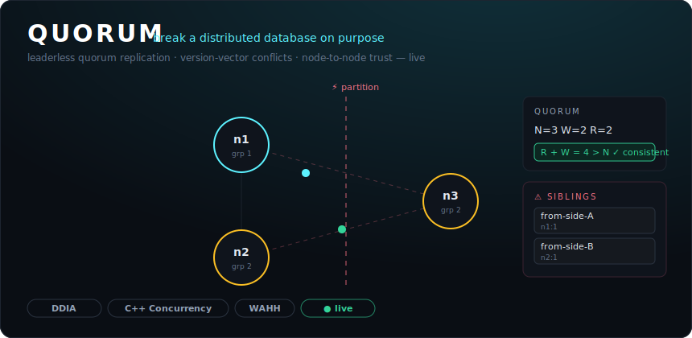

<div align="center">

# Quorum

### A leaderless distributed key-value store you can **break on purpose** — quorums, version-vector conflicts, and node-to-node trust, visualized live and node-by-node.

[](https://github.com/emirhankaplan/quorum/actions/workflows/ci.yml)
[](cluster/go.mod)
[](web/package.json)
[](LICENSE)



</div>

Quorum is a hands-on lab for the hardest ideas in distributed systems. It runs a small
**leaderless replicated cluster** (Dynamo / Cassandra style) you drive from the browser:
write and read keys with tunable **N / R / W** quorums, then deliberately **partition the
network** and **kill nodes** — and watch **version vectors** detect concurrent writes and
keep both values as *siblings* instead of silently losing data, all narrated by a live
topology graph streamed over WebSocket.

It is three canonical books made *operable* in a single artifact:

| Book | In Quorum it becomes… |
| --- | --- |
| **Designing Data-Intensive Applications** (Kleppmann) | The product itself: leaderless quorum replication, the `R + W > N` consistency rule, version-vector conflict detection with siblings, read-repair, and a consistent-hash partition ring. |
| **C++ Concurrency in Action** (Williams) | The engine inside every node: a worker pool draining a thread-safe queue, request fan-out gathered through **futures**, lock-free atomic ops counters, and a **cooperative-interruption** drain on node-kill — the book's patterns expressed in Go. |
| **The Web Application Hacker's Handbook** (Stuttard & Pinto) | The trust boundary: **mutual node authentication** (a spoofed replica is rejected) and **signed capability tokens** (a forged/escalated token is rejected), with a written [threat model](THREAT_MODEL.md). |

> Everything is **defensive and self-contained**. Quorum only ever "attacks" its own bundled
> cluster to prove its defenses hold — there is no arbitrary-target capability.

---

## ▶ The 60-second demo

1. Type `cart = apples`, set the sliders to **N=3 W=2 R=2**, and hit **PUT** — animated arrows
   fan out, two replicas light up green, the write commits. The badge reads **`R + W = 4 > N`
   → strongly consistent**.
2. Click **▶ auto CAP partition demo** (or do it by hand): the cluster splits into `{n1} | {n2,n3}`,
   the same key is written on *both* sides with a sloppy `W=1`, then the partition heals.
3. A red **CONFLICT** badge appears and the **Sibling Merge** panel slides in showing **both**
   values side by side with their version vectors — proof that nothing was silently lost.
4. Pick a merge and watch **read-repair** push the resolved value back across the ring.
5. **Kill** a node — it drains cleanly (no crash), the ring re-routes, and a `R=2` read still
   succeeds.
6. Open the **Security** panel: **Spoof a node** → the cluster flashes **REJECTED — untrusted
   node identity**; **Forge a token** → the API rejects the tampered capability.

In sixty seconds you have *felt* quorum trade-offs, watched a conflict get caught instead of
lost, killed a node without breaking the cluster, and seen the trust boundary hold.

---

## Quickstart

**Docker (one command):**

```bash
docker compose up --build
# open http://localhost:8080
```

**Local with Make:**

```bash
make run          # builds the UI + the Go binary, serves both on :8080
# open http://localhost:8080
```

**Dev mode (hot-reload UI):**

```bash
# terminal 1 — backend on :8080
cd cluster && go run ./cmd/quorum

# terminal 2 — Vite dev server on :5173 (proxies /api and /ws to :8080)
cd web && npm install && npm run dev
# open http://localhost:5173
```

---

## What you can do

- **Tune N / R / W per request** and see the `R + W > N` consistency explainer recompute live.
- **Write & read** any key through any coordinator node; inspect every replica's outcome.
- **Partition the network** into arbitrary groups and watch availability change.
- **Kill / revive** nodes (data survives a kill, like a process restart on durable disk).
- **Inject replication latency** to make fan-out and quorum-waiting visible.
- **Resolve siblings** by merging concurrent writes with a version vector that descends from all of them.
- **Inspect raw per-node state** to watch divergence during a partition and convergence after read-repair.
- **Run the security demos**: reject a spoofed node and a forged capability token.

---

## How it works

Three layers behind one trust boundary — full detail in **[ARCHITECTURE.md](ARCHITECTURE.md)**.

```
browser ──/api (token-checked)──▶ coordinator ──Transport──▶ replicas
   ▲                                  │  fan out N, wait for W (write) / R (read)
   │                                  ▼
   └────────── WebSocket ◀──── event bus ◀── nodes / chaos / coordinator
```

- **`cluster/internal/vv`** — version vectors (the conflict-detection core), exhaustively unit-tested.
- **`cluster/internal/node`** — a replica: versioned store + worker pool + cooperative drain.
- **`cluster/internal/coordinator`** — N/R/W quorum fan-out and read-repair.
- **`cluster/internal/transport`** — the swappable network seam; in-process today, gRPC-ready.
- **`cluster/internal/ring`** — consistent-hash preference lists with virtual nodes.
- **`cluster/internal/security`** — node identities + capability tokens (HMAC-SHA256).
- **`web/`** — React + TypeScript + Vite + Tailwind; a hand-drawn SVG topology, no heavy graph deps.

---

## Testing

```bash
make test     # go test ./...
make race     # go test -race ./...   (this is a concurrency project — it stays race-clean)
```

The suite covers the subtle parts on purpose: version-vector ordering (`Before`/`After`/`Concurrent`),
quorum arithmetic, write-fails-below-W, availability under a single failure, **partition → siblings**,
**sibling resolution converges**, **read-repair**, kill-drains-and-revive-preserves-data, and both
security rejections.

---

## Tech & design choices

- **Backend:** Go 1.22, standard library + `gorilla/websocket`. No database — the store is
  in-memory by design, because the *point* is to watch replication and conflicts, not to persist.
- **Frontend:** React 18 + TypeScript + Vite + Tailwind. The topology is hand-drawn SVG so the
  animations (replication pulses, partition rift, conflict flash) are fully under our control and
  the dependency surface stays tiny.
- **Why Go, not C++?** The C++ Concurrency in Action patterns — thread pool + thread-safe queue,
  futures for replica acks, atomics, interruptible threads — map cleanly onto Go's worker pool +
  channels + `errgroup`-style fan-out + `context` cancellation, and Go ships the whole cluster as a
  single static binary. The `Transport` interface leaves a clean seam to swap in a real gRPC engine
  (or a literal C++ one) later.

## License

[MIT](LICENSE)
